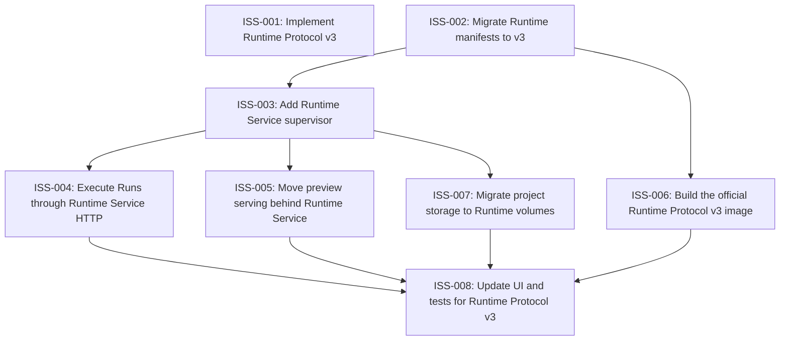

# Markdown Issue Index

Generated by derive-tracker.wasm

## Ready Queue

| ID | Priority | Type | Assignee | Title | Labels |
| --- | ---: | --- | --- | --- | --- |
| [ISS-003](ISS-003.md) | 1 | feature | unassigned | Add Runtime Service supervisor | runtime, docker, backend, supervisor |
| [ISS-006](ISS-006.md) | 1 | feature | unassigned | Build the official Runtime Protocol v3 image | runtime, docker, official-runtime |

## Unresolved Issues

| ID | Status | Priority | Type | Assignee | Blocked by | Blocks | Title |
| --- | --- | ---: | --- | --- | --- | --- | --- |
| [ISS-001](ISS-001.md) | in_progress | 1 | epic | unassigned | none | none | Implement Runtime Protocol v3 |
| [ISS-003](ISS-003.md) | open | 1 | feature | unassigned | none | ISS-004, ISS-005, ISS-007 | Add Runtime Service supervisor |
| [ISS-004](ISS-004.md) | open | 1 | feature | unassigned | ISS-003 | ISS-008 | Execute Runs through Runtime Service HTTP |
| [ISS-005](ISS-005.md) | open | 1 | feature | unassigned | ISS-003 | ISS-008 | Move preview serving behind Runtime Service |
| [ISS-006](ISS-006.md) | open | 1 | feature | unassigned | none | ISS-008 | Build the official Runtime Protocol v3 image |
| [ISS-007](ISS-007.md) | open | 2 | task | unassigned | ISS-003 | ISS-008 | Migrate project storage to Runtime volumes |
| [ISS-008](ISS-008.md) | open | 2 | task | unassigned | ISS-004, ISS-005, ISS-006, ISS-007 | none | Update UI and tests for Runtime Protocol v3 |

## Dependency Graph

## Warnings

None.

