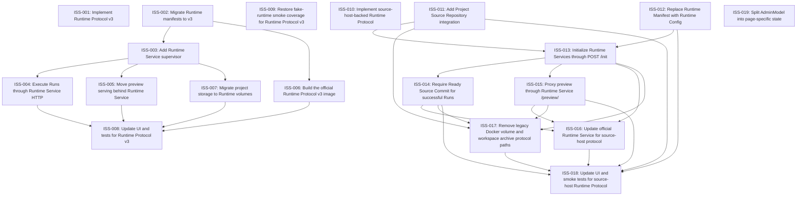

# Markdown Issue Index

Generated by derive-tracker.wasm

## Ready Queue

| ID | Priority | Type | Assignee | Title | Labels |
| --- | ---: | --- | --- | --- | --- |
| [ISS-010](ISS-010.md) | 1 | epic | unassigned | Implement source-host-backed Runtime Protocol | runtime, protocol, source-host, epic |
| [ISS-018](ISS-018.md) | 2 | task | unassigned | Update UI and smoke tests for source-host Runtime Protocol | frontend, backend, tests, smoke, docs |
| [ISS-019](ISS-019.md) | 3 | task | unassigned | Split AdminModel into page-specific state | frontend, admin, refactor |

## Unresolved Issues

| ID | Status | Priority | Type | Assignee | Blocked by | Blocks | Title |
| --- | --- | ---: | --- | --- | --- | --- | --- |
| [ISS-010](ISS-010.md) | open | 1 | epic | unassigned | none | none | Implement source-host-backed Runtime Protocol |
| [ISS-018](ISS-018.md) | open | 2 | task | unassigned | none | none | Update UI and smoke tests for source-host Runtime Protocol |
| [ISS-019](ISS-019.md) | open | 3 | task | unassigned | none | none | Split AdminModel into page-specific state |

## Dependency Graph

## Warnings

None.

