# Markdown Issue Index

Generated by derive-tracker.wasm

## Ready Queue

| ID | Priority | Type | Assignee | Title | Labels |
| --- | ---: | --- | --- | --- | --- |
| [ISS-024](ISS-024.md) | 1 | bug | unassigned | Remove Runtime Config from user-facing project DTOs | api, frontend, sdk, runtime, architecture |
| [ISS-028](ISS-028.md) | 1 | bug | unassigned | Make Runtime preview startup single-flight | runtime, preview, concurrency |

## Unresolved Issues

| ID | Status | Priority | Type | Assignee | Blocked by | Blocks | Title |
| --- | --- | ---: | --- | --- | --- | --- | --- |
| [ISS-024](ISS-024.md) | open | 1 | bug | unassigned | none | none | Remove Runtime Config from user-facing project DTOs |
| [ISS-028](ISS-028.md) | open | 1 | bug | unassigned | none | ISS-029, ISS-032 | Make Runtime preview startup single-flight |
| [ISS-029](ISS-029.md) | open | 1 | bug | unassigned | ISS-028 | ISS-030 | Remove per-request preview readiness preflight |
| [ISS-030](ISS-030.md) | open | 2 | bug | unassigned | ISS-029 | ISS-031 | Separate preview cache policy from Runtime API cache policy |
| [ISS-031](ISS-031.md) | open | 2 | task | unassigned | ISS-030 | none | Expand smoke coverage for browser-visible preview behavior |
| [ISS-032](ISS-032.md) | open | 2 | bug | unassigned | ISS-028 | none | Improve Runtime preview failure diagnostics |

## Dependency Graph

```mermaid
graph TD
  ISS_001["ISS-001: Implement Runtime Protocol v3"]
  ISS_002["ISS-002: Migrate Runtime manifests to v3"]
  ISS_003["ISS-003: Add Runtime Service supervisor"]
  ISS_004["ISS-004: Execute Runs through Runtime Service HTTP"]
  ISS_005["ISS-005: Move preview serving behind Runtime Service"]
  ISS_006["ISS-006: Build the official Runtime Protocol v3 image"]
  ISS_007["ISS-007: Migrate project storage to Runtime volumes"]
  ISS_008["ISS-008: Update UI and tests for Runtime Protocol v3"]
  ISS_009["ISS-009: Restore fake-runtime smoke coverage for Runtime Protocol v3"]
  ISS_010["ISS-010: Implement source-host-backed Runtime Protocol"]
  ISS_011["ISS-011: Add Project Source Repository integration"]
  ISS_012["ISS-012: Replace Runtime Manifest with Runtime Config"]
  ISS_013["ISS-013: Initialize Runtime Services through POST /init"]
  ISS_014["ISS-014: Require Ready Source Commit for successful Runs"]
  ISS_015["ISS-015: Proxy preview through Runtime Service /preview/"]
  ISS_016["ISS-016: Update official Runtime Service for source-host protocol"]
  ISS_017["ISS-017: Remove legacy Docker volume and workspace archive protocol paths"]
  ISS_018["ISS-018: Update UI and smoke tests for source-host Runtime Protocol"]
  ISS_019["ISS-019: Split AdminModel into page-specific state"]
  ISS_020["ISS-020: Change Runtime Config secrets to object bindings"]
  ISS_021["ISS-021: Handle create-project gateway failures as product errors"]
  ISS_022["ISS-022: Do not hide create-project errors behind the New Project dialog"]
  ISS_023["ISS-023: Add admin operation logs API"]
  ISS_024["ISS-024: Remove Runtime Config from user-facing project DTOs"]
  ISS_025["ISS-025: Make Runtime Protocol a shared MoonBit package"]
  ISS_026["ISS-026: Avoid reinitializing healthy Runtime Services"]
  ISS_027["ISS-027: Define repeated Runtime Service init semantics"]
  ISS_028["ISS-028: Make Runtime preview startup single-flight"]
  ISS_029["ISS-029: Remove per-request preview readiness preflight"]
  ISS_030["ISS-030: Separate preview cache policy from Runtime API cache policy"]
  ISS_031["ISS-031: Expand smoke coverage for browser-visible preview behavior"]
  ISS_032["ISS-032: Improve Runtime preview failure diagnostics"]
  ISS_002 --> ISS_003
  ISS_003 --> ISS_004
  ISS_003 --> ISS_005
  ISS_002 --> ISS_006
  ISS_003 --> ISS_007
  ISS_004 --> ISS_008
  ISS_005 --> ISS_008
  ISS_006 --> ISS_008
  ISS_007 --> ISS_008
  ISS_011 --> ISS_013
  ISS_012 --> ISS_013
  ISS_013 --> ISS_014
  ISS_013 --> ISS_015
  ISS_013 --> ISS_016
  ISS_014 --> ISS_016
  ISS_015 --> ISS_016
  ISS_011 --> ISS_017
  ISS_013 --> ISS_017
  ISS_014 --> ISS_017
  ISS_015 --> ISS_017
  ISS_011 --> ISS_018
  ISS_012 --> ISS_018
  ISS_014 --> ISS_018
  ISS_015 --> ISS_018
  ISS_016 --> ISS_018
  ISS_017 --> ISS_018
  ISS_028 --> ISS_029
  ISS_029 --> ISS_030
  ISS_030 --> ISS_031
  ISS_028 --> ISS_032
```

## Warnings

None.

